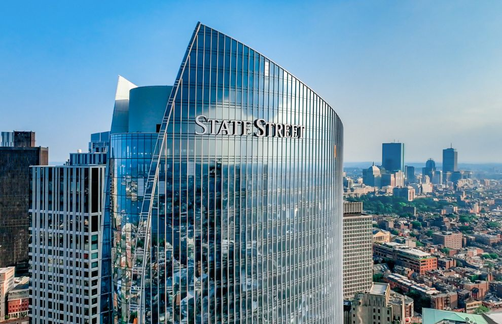
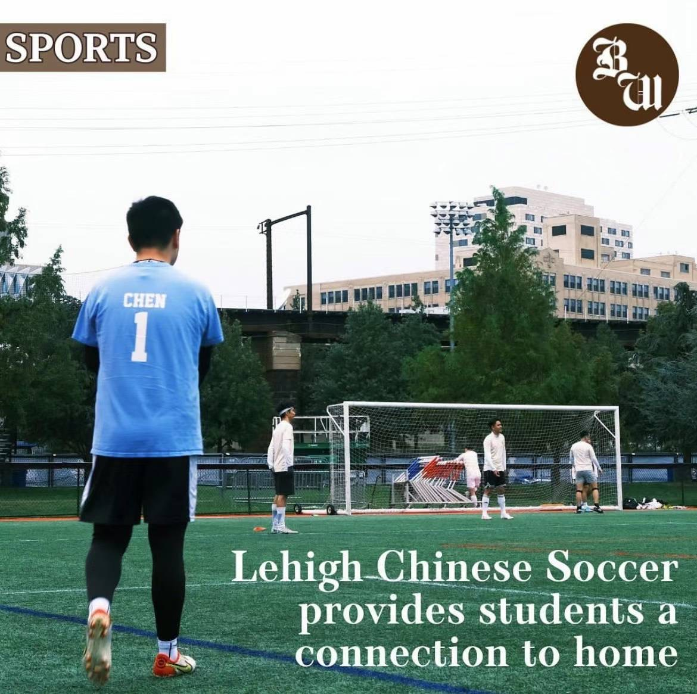

## About Me

Hi there! My name is Kevin Chen and I am from China! I am currently a junior at Lehigh University double majoring in Finance and Supply Chain Management. 

In 2023, I interned at the London Stock Exchange Group in Shanghai, China as an Assistant Financial Analyst, and in 2024, I interned at State Street in Boston, Massachusetts as an Assistant Stock Analyst. 

I have completed courses related to investments, global finance, corporate finance and real estate finance. My emial address is: mec225@lehigh.edu!

  

 

  

---

## Hobbies

I have been a big fan of Manchester City for 8 years and Boston Celtics for 5 years, and I am also an amateur goalkeeper!

I've been the starting goalkeepr for Lehigh Chinese Soccer Club for two years.

  

_**[Click here to read the article published by Lehigh Brown and White about the story of our team!](https://thebrownandwhite.com/2023/10/06/lehigh-chinese-soccer-provides-students-a-connection-to-home/)**_ 

---

## Portfolio

<!-- You can link to other websites, PDFs in this repo, and other pages in this repo -->

_**[SP24-FIN377-Data Science Project](report.md)**_

My analysis includes parsing file paths to retrieve unique identifiers (like CIK and Accession Numbers), fetching document details from the SEC’s EDGAR database, and conducting sentiment analysis on the content of 10-K reports to gauge positive and negative discussions surrounding key topics like sales, places, and risks.

---

_**[Regression Practice](Regression_practice)**_

Or: The process that created this page can be used to show off your whole midterm analysis file, as is.

---

_**[Eventual team project](https://donbowen.github.io/teamproject/)**_

---

_**[Some personal project](/pdf/sample_presentation.pdf)**_

---

## Career Objectives

Write what you want. 

Sell yourself!

---

## Hobbies

I am a big fan of Manchest City and Boston Celtics, and I am also an amateur goalkeeper!

  

---

Page template forked from <a href="https://github.com/evanca/quick-portfolio">evanca</a>

<!-- Remove above link if you don't want to attibute -->
